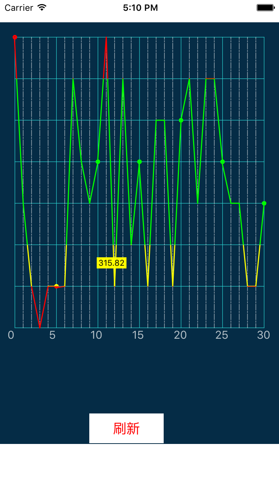

# ChartView
This resposity about the drawing is based on Core Graphics and Core Animation.

## 效果
  

#### 思路：
1、先画网格，自定义一个View，重写drawRect:方法进行网格的绘制。    
2、给自定义的View上，绘制四种颜色分布的CAGradientlayer，再设置CASharpLayer 做为遮罩，可得到曲线。    
3、两点间的差值：用线性插值的方式，有待改善。

#### pitfalls
1、在绘制四种颜色非渐变的Gradientlayer的时候，由于直接给GradientLayer 设置colors会产生渐变效果(但这里不需要渐变),所以绘制这种四块区域不同颜色的时候，重写了drawIncontext:方法，通过Core Graphiics 进行绘制。    

有待改善，欢迎各位进行修改......
